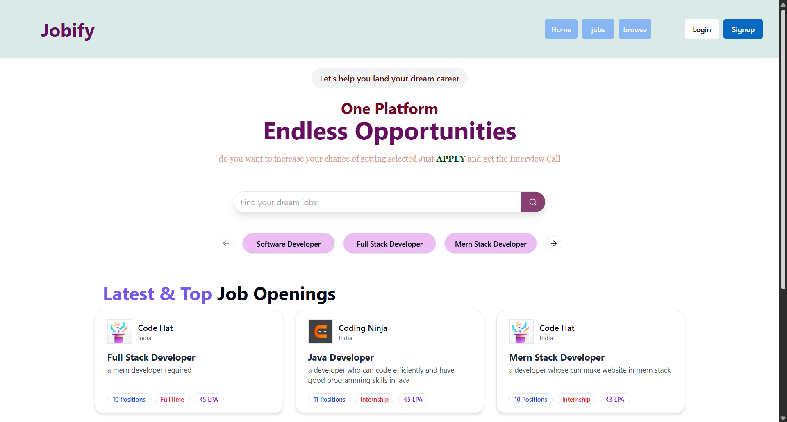
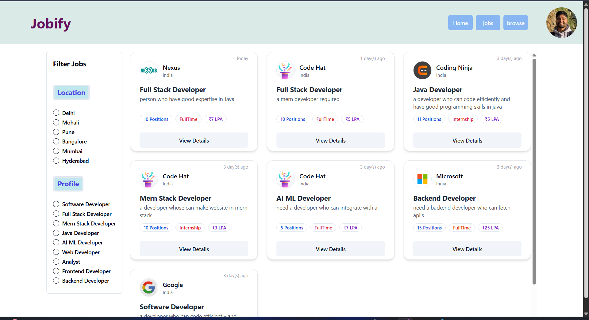
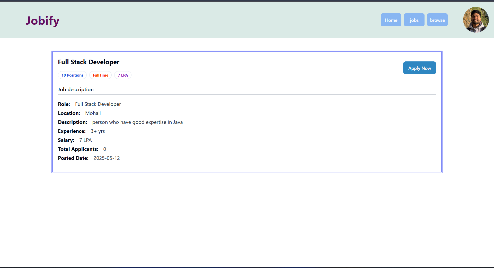
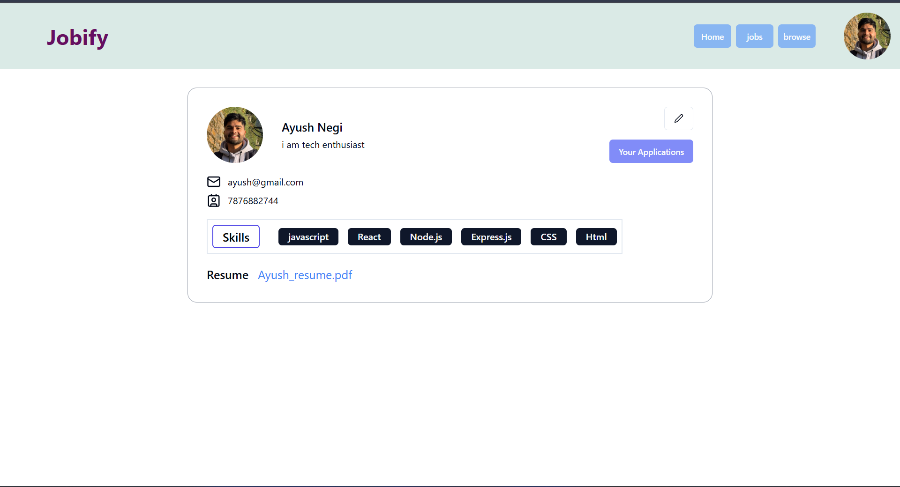
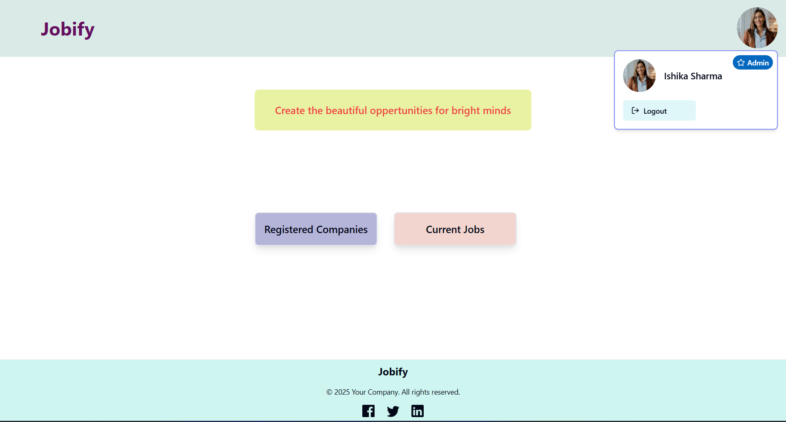

# 💼 Jobify

A full-stack job portal built with the MERN stack that connects students with recruiters.  
It provides a seamless job application experience and powerful admin controls to manage jobs, companies, and applicants.

---

## 🚀 Live Demo

🌐 [Visit Jobify Live](https://jobify-4pp2.onrender.com/)  
📁 [GitHub Repo](https://github.com/AyushNeggi/jobify)

---

## 🖼️ Screenshots

### 🏠 Home Page  

### 🔍 Job Listings / Search  

### 📄 Job Description  

### 👤 Student Profile  

### 👨‍💼 Admin Dashboard  

---

## ✨ Features

### 👨‍🎓 Student
- Browse, search, and filter jobs
- Apply for jobs with resume uploads
- Track application status (Accepted / Rejected / Pending)
- Edit profile anytime
- View job descriptions with structured info
- Responsive UI with smooth loading (skeletons & animations)

### 👩‍💼 Admin (Recruiter)
- Create and manage companies
- Post new jobs
- View & manage applications
- Delete jobs and companies anytime

---

## 🛠️ Tech Stack

**Frontend**:
- React.js
- Tailwind CSS
- ShadCN UI
- Redux Toolkit
- Framer Motion

**Backend**:
- Node.js
- Express.js
- MongoDB
- JWT Authentication
- Cloudinary (for file uploads)

**Hosting**:
- Render (Frontend + Backend)

---

## 📦 Installation & Local Setup

### 1. Clone the Repo

git clone https://github.com/AyushNeggi/jobify.git
cd jobify

2. Backend Setup

cd backend
npm install

npm run dev

3. Frontend Setup

cd ../frontend
npm install
npm run dev
